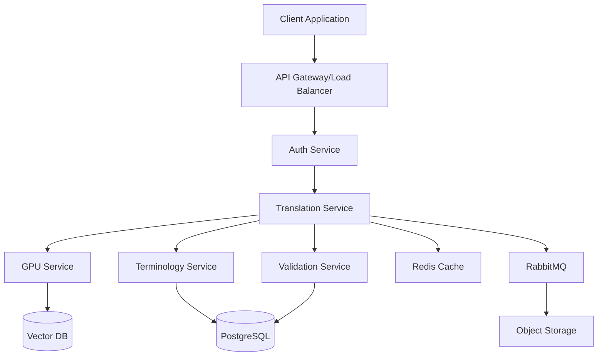

# System Architecture Document
## Enfermera Elena - Medical Record Translation System

### Version 1.0 | Date: 2025-09-05

---

## Executive Summary

This document describes the technical architecture of Enfermera Elena, a GPU-accelerated Mexican Spanish medical translation system designed for high accuracy, scalability, and HIPAA compliance. The architecture is optimized for Mexican healthcare documentation from IMSS, ISSSTE, and Seguro Popular systems.

## Architecture Principles

### Core Principles
1. **Medical Accuracy First**: Every component prioritizes clinical correctness
2. **Defense in Depth**: Multiple validation layers prevent errors
3. **Zero Trust Security**: Assume breach, verify everything
4. **Horizontal Scalability**: Components scale independently
5. **Graceful Degradation**: System remains functional during partial failures
6. **Audit Everything**: Complete traceability for compliance

## System Components

### 1. Translation Pipeline Architecture

```python
class TranslationPipeline:
    """
    Multi-stage medical document translation pipeline
    """
    
    stages = [
        "DocumentIngestion",      # Parse and validate input
        "PreProcessing",          # Clean, normalize, segment
        "MedicalNER",            # Extract medical entities
        "ContextAnalysis",       # Understand document type/context
        "Translation",           # Core translation with ensemble models
        "TerminologyAlignment",  # Map medical codes/terms
        "PostProcessing",        # Format, structure output
        "Validation",           # Medical accuracy checks
        "ConfidenceScoring"     # Assess translation quality
    ]
    
    def process(self, document):
        context = TranslationContext()
        for stage in self.stages:
            result = stage.execute(document, context)
            if result.requires_human_review:
                return self.route_to_human(result)
        return result
```

### 2. Model Architecture

#### Mexican-Optimized Translation System
```yaml
Primary Model (70% weight):
  Type: Fine-tuned XLM-RoBERTa
  Training: 500K Mexican medical document pairs
  Specialization: IMSS/ISSSTE clinical notes
  
Mexican Medical Terminology Model (30% weight):
  Type: Custom BERT fine-tuned on Mexican sources
  Training: IMSS terminology + COFEPRIS drug database
  Specialization: Mexican pharmaceutical names, IMSS codes
  
Mexican Sources:
  - IMSS clinical guidelines
  - COFEPRIS medication database
  - CONAMED medical terminology
  - Secretaría de Salud protocols

Simplified Strategy:
  - No regional classifier needed (Mexico only)
  - Focus on IMSS↔US terminology mapping
  - Mexican brand → US generic drug mapping
```

#### GPU Optimization Architecture
```python
class GPUInferenceEngine:
    """
    Optimized GPU inference using TensorRT
    """
    
    def __init__(self):
        self.models = {
            'translation': self.load_optimized_model('translation.onnx'),
            'ner': self.load_optimized_model('ner.onnx'),
            'classifier': self.load_optimized_model('classifier.onnx')
        }
        self.batch_size = 32
        self.max_sequence_length = 512
        
    def optimize_model(self, model_path):
        # Convert to ONNX
        onnx_model = convert_to_onnx(model_path)
        # Optimize with TensorRT
        trt_engine = tensorrt.optimize(
            onnx_model,
            precision='fp16',  # Half precision for speed
            workspace_size=8_000_000_000,  # 8GB workspace
            batch_size=self.batch_size
        )
        return trt_engine
        
    def batch_inference(self, texts):
        # Dynamic batching for efficiency
        batches = self.create_dynamic_batches(texts)
        results = []
        
        with cuda.stream() as stream:
            for batch in batches:
                # Asynchronous GPU execution
                results.extend(
                    self.models['translation'].infer(batch, stream)
                )
        
        return results
```

### 3. Microservices Architecture

```yaml
Services:
  TranslationService:
    Port: 8520
    Replicas: 5-20
    Responsibilities:
      - Document translation
      - Confidence scoring
      - Cache management
    Dependencies:
      - GPU Service
      - Terminology Service
      
  GPUService:
    Port: 8510
    Replicas: 2-4
    GPU: Required (1 per replica)
    Responsibilities:
      - Model inference
      - Batch processing
      - Model management
    
  TerminologyService:
    Port: 8521
    Replicas: 3-10
    Responsibilities:
      - Medical term lookup
      - ICD-10/CPT mapping
      - Custom dictionary management
    Dependencies:
      - PostgreSQL
      - Redis Cache
      
  ValidationService:
    Port: 8522
    Replicas: 3-10
    Responsibilities:
      - Medical accuracy checks
      - Dosage validation
      - Critical value detection
    
  OCRService:
    Port: 8523
    Replicas: 2-5
    GPU: Optional
    Responsibilities:
      - Handwriting recognition
      - Image preprocessing
      - Layout analysis
    
  AuditService:
    Port: 8524
    Replicas: 2
    Responsibilities:
      - HIPAA compliance logging
      - Access tracking
      - Translation history
    
  NotificationService:
    Port: 8525
    Replicas: 2
    Responsibilities:
      - Webhook delivery
      - Email notifications
      - Real-time updates
```

### 4. Data Flow Architecture



### 5. Database Schema

#### Primary Database (PostgreSQL)
```sql
-- Core translation records
CREATE TABLE translations (
    id UUID PRIMARY KEY DEFAULT gen_random_uuid(),
    source_document_id UUID NOT NULL,
    source_text TEXT NOT NULL,
    translated_text TEXT NOT NULL,
    source_language VARCHAR(10) DEFAULT 'es',
    target_language VARCHAR(10) DEFAULT 'en',
    confidence_score DECIMAL(3,2),
    model_version VARCHAR(50),
    processing_time_ms INTEGER,
    created_at TIMESTAMP DEFAULT NOW(),
    organization_id UUID,
    user_id UUID,
    INDEX idx_confidence (confidence_score),
    INDEX idx_created (created_at),
    INDEX idx_org (organization_id)
);

-- Medical terminology mappings
CREATE TABLE medical_terms (
    id SERIAL PRIMARY KEY,
    spanish_term VARCHAR(255) NOT NULL,
    english_term VARCHAR(255) NOT NULL,
    category VARCHAR(100),
    icd10_code VARCHAR(20),
    cpt_code VARCHAR(20),
    snomed_code VARCHAR(20),
    regional_variant VARCHAR(50),
    confidence DECIMAL(3,2),
    usage_count INTEGER DEFAULT 0,
    UNIQUE KEY unique_term_pair (spanish_term, english_term, regional_variant),
    INDEX idx_spanish (spanish_term),
    INDEX idx_category (category),
    FULLTEXT INDEX ft_terms (spanish_term, english_term)
);

-- Audit log for HIPAA compliance
CREATE TABLE audit_log (
    id BIGSERIAL PRIMARY KEY,
    event_type VARCHAR(50) NOT NULL,
    user_id UUID,
    resource_type VARCHAR(50),
    resource_id UUID,
    action VARCHAR(50),
    ip_address INET,
    user_agent TEXT,
    metadata JSONB,
    created_at TIMESTAMP DEFAULT NOW(),
    INDEX idx_user (user_id),
    INDEX idx_created_audit (created_at),
    INDEX idx_event (event_type)
) PARTITION BY RANGE (created_at);

-- Create monthly partitions for audit log
CREATE TABLE audit_log_2025_09 PARTITION OF audit_log
    FOR VALUES FROM ('2025-09-01') TO ('2025-10-01');
```

#### Vector Database (ChromaDB/Weaviate)
```python
# Vector schema for medical embeddings
vector_schema = {
    "class": "MedicalTerm",
    "description": "Medical terminology with embeddings",
    "vectorizer": "text2vec-transformers",
    "moduleConfig": {
        "text2vec-transformers": {
            "model": "sentence-transformers/all-MiniLM-L6-v2",
            "type": "sentence"
        }
    },
    "properties": [
        {
            "name": "spanish_term",
            "dataType": ["text"],
            "description": "Spanish medical term"
        },
        {
            "name": "english_term",
            "dataType": ["text"],
            "description": "English translation"
        },
        {
            "name": "context",
            "dataType": ["text"],
            "description": "Medical context"
        },
        {
            "name": "embedding",
            "dataType": ["number[]"],
            "description": "768-dimensional embedding"
        }
    ]
}
```

### 6. Caching Strategy

```yaml
Cache Layers:
  L1 - Application Cache:
    Location: In-memory (Python LRU)
    Size: 1000 items per instance
    TTL: 5 minutes
    Content: Recent translations
    
  L2 - Redis Cache:
    Location: Redis Cluster
    Size: 16GB
    TTL: 1 hour
    Content: 
      - Frequently used terms
      - Session data
      - API responses
    
  L3 - CDN Cache:
    Location: CloudFlare/Fastly
    TTL: 24 hours
    Content:
      - Static assets
      - Medical dictionaries
      - Model artifacts

Cache Key Strategy:
  Translation: "trans:{hash(source_text)}:{lang_pair}:{model_version}"
  Term: "term:{spanish_term}:{regional_variant}"
  Session: "session:{user_id}:{session_id}"
```

### 7. Security Architecture

#### Zero Trust Network Architecture
```yaml
Network Segmentation:
  DMZ:
    - Load Balancers
    - WAF (Web Application Firewall)
    
  Application Tier:
    - API Services
    - Translation Services
    - No direct internet access
    
  Data Tier:
    - Databases
    - Cache layers
    - Isolated network
    
  GPU Tier:
    - GPU compute nodes
    - Model storage
    - Air-gapped from internet

Service Mesh (Istio):
  - mTLS between all services
  - Automatic certificate rotation
  - Circuit breaking
  - Rate limiting per service
  
Authentication Flow:
  1. Client → API Gateway (TLS 1.3)
  2. API Gateway → Auth Service (mTLS)
  3. Auth Service validates JWT
  4. Service-to-service with mTLS + service account
```

#### Encryption Architecture
```python
class EncryptionManager:
    """
    Handles all encryption operations
    """
    
    def __init__(self):
        self.kms = boto3.client('kms')  # or HashiCorp Vault
        self.data_key = self.get_data_key()
        
    def encrypt_document(self, document):
        # Generate unique DEK per document
        dek = self.generate_dek()
        
        # Encrypt document with DEK
        encrypted = AES_256_GCM.encrypt(document, dek)
        
        # Encrypt DEK with KEK from KMS
        encrypted_dek = self.kms.encrypt(
            KeyId=self.kek_id,
            Plaintext=dek
        )
        
        return {
            'encrypted_data': encrypted,
            'encrypted_key': encrypted_dek,
            'algorithm': 'AES-256-GCM',
            'key_version': self.key_version
        }
    
    def decrypt_document(self, encrypted_doc):
        # Decrypt DEK using KMS
        dek = self.kms.decrypt(
            CiphertextBlob=encrypted_doc['encrypted_key']
        )
        
        # Decrypt document with DEK
        return AES_256_GCM.decrypt(
            encrypted_doc['encrypted_data'],
            dek['Plaintext']
        )
```

### 8. High Availability Architecture

```yaml
Multi-Region Deployment:
  Primary Region (US-East):
    - Active services
    - Primary database
    - GPU cluster
    
  Secondary Region (US-West):
    - Standby services
    - Read replica database
    - GPU cluster (reduced capacity)
    
  Failover Strategy:
    - DNS failover: 60 seconds
    - Database promotion: 5 minutes
    - Service migration: Automatic
    - Data sync: Asynchronous replication

Load Balancing:
  External:
    - CloudFlare or AWS ALB
    - Geographic routing
    - DDoS protection
    
  Internal:
    - NGINX or HAProxy
    - Least connections algorithm
    - Health checks every 5 seconds
    
Health Checks:
  - HTTP: /health (basic liveness)
  - HTTP: /ready (full readiness)
  - GPU: Model loading verification
  - Database: Connection pool status
```

### 9. Monitoring Architecture

```yaml
Metrics Collection:
  Prometheus:
    - Scrape interval: 15 seconds
    - Retention: 30 days
    - Federation for multi-region
    
  Custom Metrics:
    translation_duration_seconds{document_type, model}
    translation_confidence_score{language_pair}
    gpu_inference_latency_ms{model, batch_size}
    medical_term_cache_hit_ratio
    
Distributed Tracing:
  Jaeger:
    - Sampling: 1% of requests
    - Critical paths: 100% sampling
    - Retention: 7 days
    
  Trace Points:
    - API Gateway entry
    - Service boundaries
    - Database queries
    - GPU inference
    - Cache operations

Logging Pipeline:
  FluentD → Kafka → Elasticsearch → Kibana
  
  Log Aggregation:
    - Application logs
    - Audit logs (separate index)
    - System logs
    - GPU/CUDA logs

Alerting:
  AlertManager:
    Critical:
      - Service down > 1 minute
      - Error rate > 1%
      - GPU failure
      - Database replication lag > 5 seconds
    
    Warning:
      - Response time > 2 seconds (p95)
      - CPU usage > 70%
      - Disk usage > 75%
      - Queue depth > 1000
```

### 10. Deployment Architecture

```yaml
Container Strategy:
  Base Images:
    - Python: python:3.11-slim
    - GPU: nvidia/cuda:12.0-runtime-ubuntu22.04
    - Node: node:20-alpine
    
  Multi-stage Builds:
    - Stage 1: Dependencies
    - Stage 2: Application
    - Stage 3: Runtime (minimal)
    
  Size Targets:
    - API services: <500MB
    - GPU services: <2GB
    - Frontend: <100MB

Kubernetes Deployment:
  Namespaces:
    - enfermera-dev
    - enfermera-staging
    - enfermera-production
    
  Resource Management:
    API Pods:
      requests:
        cpu: 500m
        memory: 1Gi
      limits:
        cpu: 2000m
        memory: 4Gi
    
    GPU Pods:
      requests:
        nvidia.com/gpu: 1
        memory: 32Gi
      limits:
        nvidia.com/gpu: 1
        memory: 48Gi
    
  Autoscaling:
    HPA:
      - Target CPU: 60%
      - Min replicas: 3
      - Max replicas: 20
    
    VPA:
      - Update mode: Auto
      - Resource policy: Uncapped
```

## Integration Architecture

### EHR Integration
```python
class FHIRIntegration:
    """
    HL7 FHIR integration for EHR systems
    """
    
    def translate_document_reference(self, fhir_doc):
        # Extract document from FHIR DocumentReference
        document = self.extract_document(fhir_doc)
        
        # Translate
        translation = self.translation_service.translate(document)
        
        # Create new DocumentReference with translation
        translated_ref = self.create_document_reference(
            original=fhir_doc,
            translation=translation,
            metadata={
                'confidence': translation.confidence,
                'model_version': translation.model_version,
                'processing_time': translation.time_ms
            }
        )
        
        return translated_ref
    
    def handle_batch_bundle(self, bundle):
        # Process FHIR Bundle for batch translation
        results = []
        for entry in bundle.entry:
            if entry.resource.resourceType == "DocumentReference":
                results.append(
                    self.translate_document_reference(entry.resource)
                )
        
        return self.create_bundle(results)
```

### API Gateway Configuration
```nginx
# NGINX configuration for API Gateway
upstream translation_backend {
    least_conn;
    server translation-service-1:8520 max_fails=3 fail_timeout=30s;
    server translation-service-2:8520 max_fails=3 fail_timeout=30s;
    server translation-service-3:8520 max_fails=3 fail_timeout=30s;
    keepalive 32;
}

server {
    listen 443 ssl http2;
    server_name api.enfermera-elena.com;
    
    # SSL Configuration
    ssl_certificate /etc/nginx/ssl/cert.pem;
    ssl_certificate_key /etc/nginx/ssl/key.pem;
    ssl_protocols TLSv1.3;
    ssl_ciphers 'TLS13-AES-256-GCM-SHA384:TLS13-AES-128-GCM-SHA256';
    
    # Security Headers
    add_header Strict-Transport-Security "max-age=31536000; includeSubDomains" always;
    add_header X-Content-Type-Options nosniff always;
    add_header X-Frame-Options DENY always;
    
    # Rate Limiting
    limit_req_zone $binary_remote_addr zone=api:10m rate=10r/s;
    limit_req zone=api burst=20 nodelay;
    
    # Request Size Limits
    client_max_body_size 100M;
    
    location /api/v1/translate {
        proxy_pass http://translation_backend;
        proxy_http_version 1.1;
        proxy_set_header Connection "";
        proxy_set_header Host $host;
        proxy_set_header X-Real-IP $remote_addr;
        proxy_set_header X-Forwarded-For $proxy_add_x_forwarded_for;
        proxy_set_header X-Request-ID $request_id;
        
        # Timeouts
        proxy_connect_timeout 5s;
        proxy_send_timeout 60s;
        proxy_read_timeout 60s;
        
        # Circuit Breaker
        proxy_next_upstream error timeout http_500 http_502 http_503;
        proxy_next_upstream_tries 3;
    }
}
```

## Performance Optimization

### GPU Optimization Techniques
```python
class GPUOptimizer:
    """
    GPU-specific optimizations for inference
    """
    
    def __init__(self):
        self.use_mixed_precision = True
        self.use_tensor_cores = True
        self.dynamic_batching = True
        
    def optimize_inference(self):
        optimizations = {
            # Model optimizations
            'quantization': 'int8',  # 4x speedup
            'pruning': 0.1,  # 10% weight pruning
            'distillation': True,  # Smaller student model
            
            # Runtime optimizations
            'graph_optimization': True,
            'kernel_fusion': True,
            'memory_pooling': True,
            
            # Batching optimizations
            'dynamic_padding': True,
            'sequence_bucketing': True,
            'continuous_batching': True
        }
        
        return optimizations
```

### Database Query Optimization
```sql
-- Optimized query for term lookup with caching hint
WITH ranked_terms AS (
    SELECT 
        spanish_term,
        english_term,
        confidence,
        ROW_NUMBER() OVER (
            PARTITION BY spanish_term 
            ORDER BY confidence DESC, usage_count DESC
        ) as rank
    FROM medical_terms
    WHERE spanish_term = $1
        AND ($2::varchar IS NULL OR regional_variant = $2)
)
SELECT /*+ RESULT_CACHE */ 
    spanish_term,
    english_term,
    confidence
FROM ranked_terms
WHERE rank = 1;

-- Create materialized view for common translations
CREATE MATERIALIZED VIEW common_translations AS
SELECT 
    t.source_text,
    t.translated_text,
    t.confidence_score,
    COUNT(*) as usage_count
FROM translations t
WHERE t.created_at > NOW() - INTERVAL '30 days'
GROUP BY t.source_text, t.translated_text, t.confidence_score
HAVING COUNT(*) > 10
ORDER BY COUNT(*) DESC;

-- Refresh strategy
CREATE INDEX idx_common_trans_source ON common_translations(source_text);
REFRESH MATERIALIZED VIEW CONCURRENTLY common_translations;
```

## Disaster Recovery

### Backup and Recovery Procedures
```yaml
Backup Strategy:
  Databases:
    - Continuous archiving (WAL streaming)
    - Full backup: Daily at 2 AM UTC
    - Incremental: Every 6 hours
    - Retention: 30 days
    - Cross-region replication
    
  Models:
    - Version control in S3/GCS
    - Immutable storage
    - Retention: Last 10 versions
    
  Configuration:
    - Git repository
    - Encrypted secrets in Vault
    - Infrastructure as Code (Terraform)

Recovery Procedures:
  RPO (Recovery Point Objective): 1 hour
  RTO (Recovery Time Objective): 2 hours
  
  Scenario 1 - Service Failure:
    1. Kubernetes automatically restarts pod
    2. If persistent, scale replicas
    3. Route traffic to healthy instances
    Time: <1 minute
    
  Scenario 2 - Database Failure:
    1. Automatic failover to replica
    2. Promote replica to primary
    3. Spin up new replica
    Time: <5 minutes
    
  Scenario 3 - Region Failure:
    1. DNS failover to secondary region
    2. Verify data consistency
    3. Scale secondary region capacity
    Time: <15 minutes
    
  Scenario 4 - Data Corruption:
    1. Identify corruption timestamp
    2. Restore from closest clean backup
    3. Replay WAL to point before corruption
    4. Validate data integrity
    Time: 1-2 hours
```

### Business Continuity Plan
```yaml
Communication Plan:
  - Status page: status.enfermera-elena.com
  - Customer notification: Within 15 minutes
  - Escalation chain: Defined in PagerDuty
  
Service Degradation Levels:
  Level 1 - Full Service:
    - All features available
    - Normal performance
    
  Level 2 - Reduced Capacity:
    - Batch processing delayed
    - Increased response times
    - Priority queue for critical requests
    
  Level 3 - Essential Service:
    - Translation only (no validation)
    - Cached responses where possible
    - Manual review required
    
  Level 4 - Maintenance Mode:
    - Read-only access
    - No new translations
    - Historical data available

Testing Schedule:
  - Failover drill: Monthly
  - Backup recovery: Quarterly
  - Full DR simulation: Bi-annually
```

## Appendices

### A. Technology Decisions Record

| Decision | Choice | Rationale | Alternatives Considered |
|----------|--------|-----------|------------------------|
| Primary Language | Python 3.11 | ML ecosystem, team expertise | Go, Rust |
| ML Framework | PyTorch | Flexibility, GPU support | TensorFlow, JAX |
| API Framework | FastAPI | Performance, async, OpenAPI | Flask, Django |
| Message Queue | RabbitMQ | Reliability, ease of use | Kafka, SQS |
| Container Runtime | Docker | Industry standard | Podman, containerd |
| Orchestration | Kubernetes | Scalability, ecosystem | ECS, Nomad |
| Service Mesh | Istio | Features, maturity | Linkerd, Consul |

### B. Capacity Calculations

```python
# Capacity planning calculations
daily_documents = 100_000
avg_document_pages = 5
avg_page_size_kb = 50
processing_time_per_page_ms = 500

# Compute requirements
total_daily_pages = daily_documents * avg_document_pages
total_compute_time_hours = (total_daily_pages * processing_time_per_page_ms) / (1000 * 60 * 60)
required_gpu_hours = total_compute_time_hours / 0.8  # 80% efficiency

# Storage requirements
daily_storage_gb = (daily_documents * avg_document_pages * avg_page_size_kb) / (1024 * 1024)
yearly_storage_tb = (daily_storage_gb * 365) / 1024

# Network requirements
peak_hour_percentage = 0.3  # 30% of daily traffic in peak hour
peak_bandwidth_mbps = (daily_documents * peak_hour_percentage * avg_document_pages * avg_page_size_kb * 8) / (3600 * 1024)

print(f"Daily GPU hours needed: {required_gpu_hours:.1f}")
print(f"Daily storage growth: {daily_storage_gb:.1f} GB")
print(f"Peak bandwidth required: {peak_bandwidth_mbps:.1f} Mbps")
```

---

*Document Status: Architecture baseline established*  
*Next Review: After technical requirements approval*  
*Architecture Lead: TBD*